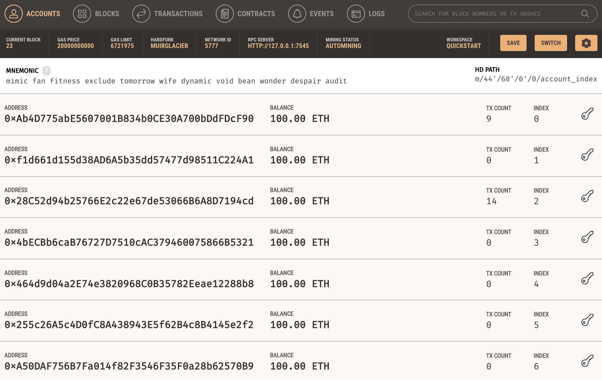

# Golang smart contract development

## Context

* I am trying to learn how to code smart contracts in go :) 
* Set up a simple decentralized bank
* Anyone with etheum account can fund money with given amount
* Anyone can transfer given amount of money to others

## Prerequisites

* [Deploy Local Etheurem Development Network Ganache](https://www.trufflesuite.com/ganache)

    The console has 10 prefunded accounts

    

* Install golang 1.16+
* Install [go-etheum](https://github.com/ethereum/go-ethereum)

## Technical Explaination

* A [solidity](https://docs.soliditylang.org/en/v0.8.10/) [smart contract](https://ethereum.org/en/developers/docs/smart-contracts/) [coin.sol](pkg/contracts/coin.sol)

    It has a map with key, account address and value, account balance **note the account balance is a new "currency" rather than eth** 

    It has two methods:

    mint - caller can fund money to itself

    send - callder can send money from their balance to others

* go etheum tool abigen generates the go objects based on [coin.sol](pkg/cmd/contracts/coin.sol)
* The app implements with three commands:
   * deploy
   * bank fund
   * bank transfer
   * bank balance

## How to run

* Two users used here

    |role|address|private_key|
    |----|-------|-----------|
    |deployer, sender|0x28C52d94b25766E2c22e67de53066B6A8D7194cd|6ae828640bbccdece4c13abc0073a3e8620791389babbbce1b3e73c56cd025f8|
    |receiver|0x464d9d04a2E74e3820968C0B35782Eeae12288b8|349327b0f9219eb24ef4a5fa9005e3fbd5cb340846ebcc12977bb8dac28664e9|

* Deploy

    ```
    go run cmd/deploy/deploy.go --private-key 6ae828640bbccdece4c13abc0073a3e8620791389babbbce1b3e73c56cd025f8
    Successfully deployed the contract to http://127.0.0.1:7545 with address: 0x990295958B90AB1f20d5229B36Ab32916672de82
    ```

    This command deploys the smart contract to local network

* Fund

    ```
    go run cmd/bank/bank.go --private-key 6ae828640bbccdece4c13abc0073a3e8620791389babbbce1b3e73c56cd025f8 --contract-address 0x990295958B90AB1f20d5229B36Ab32916672de82 fund --amount 1000
    Successfully fund  with 1000
    ```

    The caller funds 1000 to its account


* Check the Balance

    ```
    go run cmd/bank/bank.go --private-key 6ae828640bbccdece4c13abc0073a3e8620791389babbbce1b3e73c56cd025f8 --contract-address 0x990295958B90AB1f20d5229B36Ab32916672de82 balance
    The balance is 1000
    ```

    The caller checks its balance

* Transfer the fund to another account

    ```
    go run cmd/bank/bank.go --private-key 6ae828640bbccdece4c13abc0073a3e8620791389babbbce1b3e73c56cd025f8 --contract-address 0x990295958B90AB1f20d5229B36Ab32916672de82 transfer --receiver 0x464d9d04a2E74e3820968C0B35782Eeae12288b8 --amount 120
    Successfully transfer 0x464d9d04a2E74e3820968C0B35782Eeae12288b8 with 120
    ```

    ```
    go run cmd/bank/bank.go --private-key 6ae828640bbccdece4c13abc0073a3e8620791389babbbce1b3e73c56cd025f8 --contract-address 0x990295958B90AB1f20d5229B36Ab32916672de82 balance
    The balance is 880
    ```

    ```
    go run cmd/bank/bank.go --private-key 349327b0f9219eb24ef4a5fa9005e3fbd5cb340846ebcc12977bb8dac28664e9 --contract-address 0x990295958B90AB1f20d5229B36Ab32916672de82 balance
    The balance is 120
    ```

* Deploy to a real or live test network? 

  run command with --client-url [endpoint]

  E.g. you can use https://rinkeby.infura.io/v3/[project_key]  

  rinbeky is a etheurm test network. infura is a node as a service provider that you can sign up a free acount [here](https://infura.io/)


